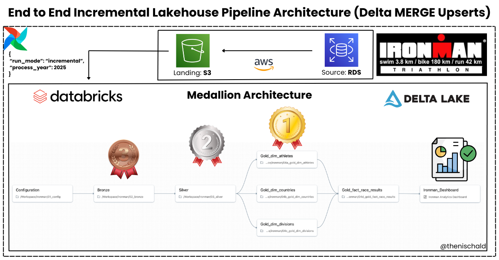
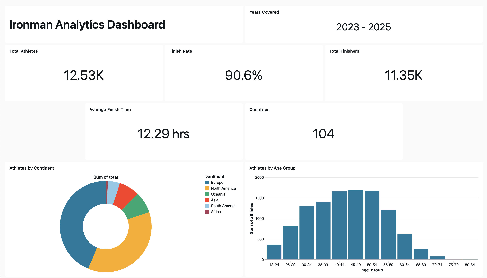
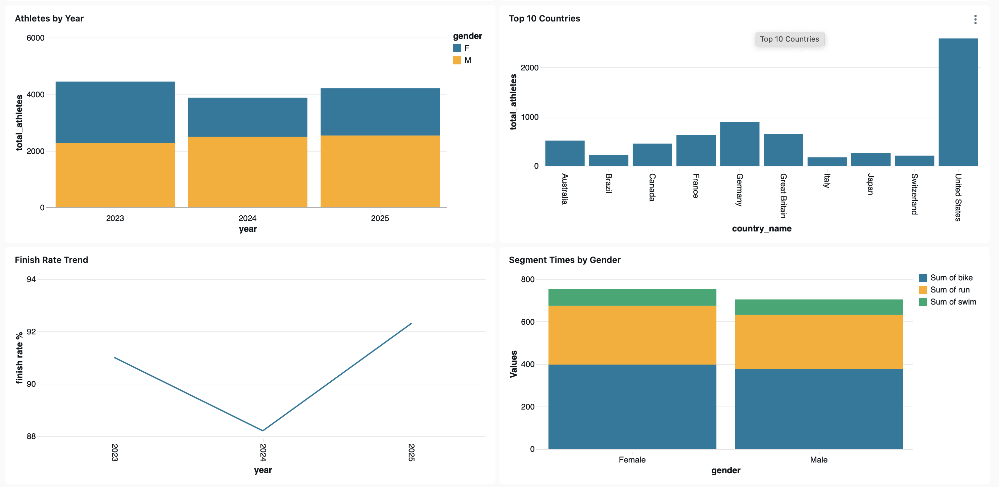
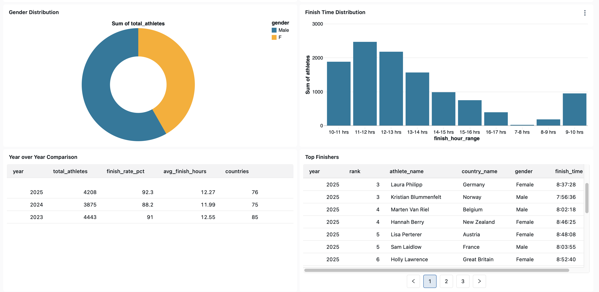
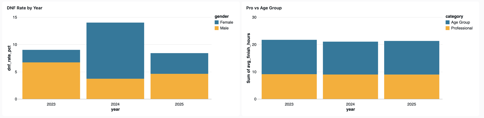

# Ironman Triathlon Analytics Platform

## Overview

This repo contains a data pipeline that ingests Ironman race results from AWS RDS (PostgreSQL), lands raw CSV files in S3, processes them in Databricks using a Medallion (Bronze/Silver/Gold) architecture, and powers a dynamic analytics dashboard that automatically updates when new year data is processed.

The pipeline supports incremental upserts using Delta Lake `MERGE`, so rerunning a year does not duplicate rows.



## Key Features

- **Medallion Architecture**: Bronze -> Silver -> Gold data layers with Delta Lake
- **Incremental Processing**: Process only new data (by year) without reprocessing historical data
- **Star Schema Design**: Dimensional modeling with fact and dimension tables
- **Dynamic Dashboards**: Auto updating visualizations when new data arrives
- **Orchestration**: Fully automated pipeline with Airflow 3.0
- **Cloud Native**: Built on AWS (RDS, S3) and Databricks

## Repository structure

### Airflow (`ironman_airflow/`)

- `dags/ironman_dag.py`
  - Extracts from RDS and uploads CSVs to S3
  - Validates expected files exist in S3
  - Triggers a Databricks multi-task job with parameters

### Databricks notebooks (`notebooks_databricks/`)

- `01_config`

  - Central configuration notebook
  - Reads runtime parameters and produces a JSON config passed to downstream tasks
  - Filters which files to process based on `process_year`

- `02_bronze`

  - Reads CSVs from the Volume landing path
  - Normalizes dash values to nulls
  - Adds metadata columns and generates a stable `row_key`
  - Writes to Delta table with overwrite (full) or merge (incremental)

- `03_silver`

  - Casts types, parses time columns into seconds, standardizes fields
  - Adds status flags and validation fields
  - Writes to Delta table with overwrite (full) or merge (incremental)

- `04a_gold_dim_athletes`

  - Builds athlete dimension with a natural key
  - Uses a deterministic selection for each natural key and merges incrementally

- `04b_gold_dim_countries`

  - Builds country dimension with mapping to name and continent
  - Merges incrementally

- `04c_gold_dim_divisions`

  - Builds division dimension, parses gender/pro/age group
  - Merges incrementally

- `04d_gold_fact_race_results`

  - Joins dimensions to create a star schema fact table
  - Merges incrementally using `row_key`

- `05_dashboard_queries`

  - Dashboard SQL Queries

### Scraper (Raw Data) (`ironman_scraper/`)

- `ironman_scraper.py`

  - Python script to scrape race data from Ironman website

- `data/`
  - Contains scraped data for years 2023, 2024 & 2025:
    - `2023_men.csv`
    - `2023_women.csv`
    - `2024_men.csv`
    - `2024_women.csv`
    - `2025_men.csv`
    - `2025_women.csv`

## Data model

### Bronze table

- `ironman.bronze.ironman_results`
  Raw-ish records plus metadata and unique row key.

### Silver table

- `ironman.silver.ironman_results`
  Cleaned, typed, time columns parsed to seconds, quality flags.

### Gold tables (star schema)

- `ironman.gold.dim_athletes`
- `ironman.gold.dim_countries`
- `ironman.gold.dim_divisions`
- `ironman.gold.fact_race_results`

### Star Schema

```
                    ┌─────────────────┐
                    │  dim_athletes   │
                    │─────────────────│
                    │ athlete_key (PK)│
                    │ athlete_name    │
                    │ first_name      │
                    │ last_name       │
                    │ country         │
                    └────────┬────────┘
                             │
┌─────────────────┐          │          ┌─────────────────┐
│  dim_divisions  │          │          │  dim_countries  │
│─────────────────│          │          │─────────────────│
│ division_key(PK)│          │          │ country_key (PK)│
│ division        │          │          │ country_name    │
│ gender          │          │          │ continent       │
│ age_group_start │          │          └────────┬────────┘
│ age_group_end   │          │                   │
│ is_professional │          │                   │
└────────┬────────┘          │                   │
         │                   │                   │
         │     ┌─────────────┴───────────────┐   │
         │     │      fact_race_results      │   │
         │     │─────────────────────────────│   │
         └────>│ fact_key (PK)               │<──┘
               │ athlete_key (FK)            │
               │ division_key (FK)           │
               │ country_key (FK)            │
               │ year                        │
               │ rank, div_rank, points      │
               │ swim_time_seconds           │
               │ bike_time_seconds           │
               │ run_time_seconds            │
               │ finish_time_seconds         │
               │ is_finisher, is_dnf, is_dns │
               └─────────────────────────────┘
```

## Incremental Processing

This pipeline supports **two run modes**:

- **Full Load**: processes **all years** (rebuilds tables)
- **Incremental Load**: processes **one specific year** (Delta `MERGE` upserts)

### Full Load (All Years)

Trigger Airflow with:

```json
{
  "run_mode": "incremental",
  "process_year": "2025"
}
```

### How It Works

1. **Airflow** extracts only the specified year from RDS
2. **Bronze** reads only new CSV files
3. **Silver/Gold** merge new data using Delta Lake MERGE
4. **Dashboard** auto updates (views query live tables)

## Analytics Dashboard






## Contact

If you have questions, run into issues, or want help understanding any part of the pipeline, feel free to reach out:

- LinkedIn: https://www.linkedin.com/in/thenischald
- Portfolio: https://nischaldinesh.com
